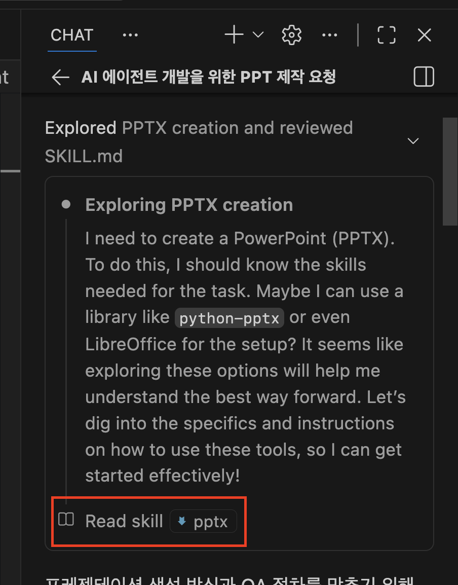

# GitHub Copilot Skill 활용 실습

> **목표**: Agent Skill의 효과를 직접 체험하고, skill-creator로 나만의 스킬을 만들어 본다.
>
> **환경**: WSL + Windows, VSCode, GitHub Copilot (유료 계정)
>
> **소요 시간**: 약 60분

---

## 실습1: pptx 스킬 — 스킬 유무에 따른 품질 차이 체험 (I DO)

> 강사가 시연합니다. 화면을 보며 따라오세요.

### 1-1. 실습 폴더 준비

하나의 작업 폴더 안에 `with-skill`, `no-skill` 두 개의 프로젝트를 만들어 비교합니다.

```bash
# 작업 폴더 생성
mkdir -p ~/copilot-skill-lab && cd ~/copilot-skill-lab

# 스킬 저장소 클론 (공용)
git clone https://github.com/anthropics/skills.git

# ── with-skill 프로젝트 ──
mkdir -p with-skill && cd with-skill
git init
mkdir -p .github/skills
cp -r ../skills/pptx .github/skills/pptx
cd ..

# ── no-skill 프로젝트 ──
mkdir -p no-skill && cd no-skill
git init
cd ..
```

최종 구조:

```
copilot-skill-lab/
├── skills/                  # 클론한 원본 (참조용)
├── with-skill/
│   └── .github/skills/
│       └── pptx/
│           └── SKILL.md     # ← Copilot이 자동으로 읽음
└── no-skill/                # 비어있는 git 저장소
```

### 1-2. 같은 프롬프트로 비교

각각 VSCode로 열고, **GitHub Copilot Agent 모드**(Chat → Agent)에서 동일한 프롬프트를 입력합니다.

```
코드 에이전트에 대한 10장 분량의 pptx 작성해줘.
```

### 1-3. 차이 관찰

| 관찰 포인트 | `with-skill` | `no-skill` |
|-------------|-------------|------------|
| SKILL.md 로드 로그 | "Read SKILL.md" 로그 확인됨 | 로그 없음 |
| python-pptx 설치 | 자동으로 `pip install` 실행 | 미설치 or 수동 필요 |
| 슬라이드 품질 | 레이아웃·스타일 가이드 준수 | 기본 템플릿, 일관성 부족 |
| 스크립트 구조 | SKILL.md의 베스트 프랙티스 반영 | 임의 구현 |



### 1-4. 결과물 확인 (WSL 환경)

WSL에서 생성된 `.pptx` 파일을 Windows PowerPoint으로 열어봅니다.

```bash
# 1단계: VSCode Explorer에서 .pptx 파일 우클릭 → "Copy Path"

# 2단계: VSCode 터미널에서 실행
explorer.exe "<복사한 경로>"

# 예시:
explorer.exe "/home/username/copilot-skill-lab/with-skill/output.pptx"
```

### 1-5. AGENTS.md로 프로젝트 지침 추가

스킬 외에 **프로젝트 전체 규칙**은 `AGENTS.md`로 지정할 수 있습니다.

```bash
# with-skill 프로젝트 루트에 생성
cat > AGENTS.md << 'EOF'
# 프로젝트 규칙

- 모든 산출물은 한국어로 작성한다.
- 슬라이드 제목은 명사형으로 끝낸다.
- 코드 예시는 Python 3.11+ 기준으로 작성한다.
EOF
```

> **참고 — Copilot이 인식하는 지침 파일들**
>
> | 파일 | 용도 |
> |------|------|
> | `/.github/copilot-instructions.md` | Copilot 전용 전역 지침 |
> | `/.github/instructions/**/*.instructions.md` | 파일/패턴별 세부 지침 |
> | `**/AGENTS.md` | 디렉토리별 에이전트 행동 규칙 |
> | `/CLAUDE.md` | Claude Code 전용 지침 |
> | `/GEMINI.md` | Gemini 전용 지침 |

---

## 실습2: skill-creator로 스킬 만들기 (WE DO)

> 강사와 함께 step-by-step으로 진행합니다.

### 목표

**Conventional Commit Message Generator** 스킬을 skill-creator로 만들어 봅니다.

- 변경 설명을 주면 → `feat(auth): implement JWT-based login` 형태로 변환
- 스킬 없이 시키면 매번 스타일이 다르지만, 스킬이 있으면 포맷이 일관됨

### 2-1. skill-creator 설치

```bash
cd ~/copilot-skill-lab/with-skill

# skill-creator 스킬 복사
cp -r ../skills/skill-creator .github/skills/skill-creator
```

구조 확인:

```
with-skill/
└── .github/skills/
    ├── pptx/
    │   └── SKILL.md
    └── skill-creator/
        └── SKILL.md          # ← 스킬을 만드는 스킬
```

### 2-2. Copilot에게 스킬 생성 요청

VSCode Copilot Agent 모드에서 다음 프롬프트를 입력합니다.

```
"Conventional Commit Message Generator" 스킬을 만들어줘.

요구사항:
- 변경 설명을 입력하면 Conventional Commits 포맷으로 변환
- type은 feat, fix, docs, style, refactor, test, chore만 허용
- 50자 이내, 소문자로 시작
- 검증 스크립트(validate_commit.py) 포함
```

### 2-3. 생성 과정 관찰

skill-creator가 자동으로 수행하는 작업을 확인합니다:

1. **SKILL.md 작성** — 스킬의 목적, 입출력 형식, 규칙 정의
2. **스크립트 생성** — `validate_commit.py` (정규식으로 포맷 검증)
3. **eval 작성** — 스킬 품질을 측정하는 테스트 케이스

### 2-4. 생성된 스킬 구조 확인

```
.github/skills/
└── conventional-commit/
    ├── SKILL.md                # 스킬 정의
    ├── scripts/
    │   └── validate_commit.py  # 포맷 검증 스크립트
    └── evals/
        └── eval.md             # 평가 기준
```

### 2-5. 검증 스크립트 확인

생성된 `validate_commit.py`가 다음을 검증하는지 확인합니다:

```python
import re
import sys

VALID_TYPES = {"feat", "fix", "docs", "style", "refactor", "test", "chore"}

def validate(message: str) -> bool:
    pattern = r'^(feat|fix|docs|style|refactor|test|chore)(\(.+\))?: .+'
    match = re.match(pattern, message)
    if not match:
        return False
    if len(message) > 50:
        return False
    # 콜론 뒤 설명이 소문자로 시작하는지
    desc = message.split(": ", 1)[1]
    if desc[0].isupper():
        return False
    return True

if __name__ == "__main__":
    msg = sys.argv[1] if len(sys.argv) > 1 else input("Commit message: ")
    if validate(msg):
        print("✓ Valid")
    else:
        print("✗ Invalid")
        sys.exit(1)
```

### 2-6. 스킬 테스트

스킬이 설치된 상태에서 Copilot에게 커밋 메시지 생성을 요청합니다.

```
다음 변경사항에 대한 커밋 메시지를 작성해줘:
- 사용자 로그인 API에 JWT 토큰 기반 인증을 추가했다.
- refresh token 로직도 포함되어 있다.
```

**기대 결과**: `feat(auth): add JWT-based authentication with refresh token`

스킬 없이 같은 질문을 하면 매번 다른 스타일이 나오는 것과 비교해 보세요.

---

## 실습3: 스킬 직접 작성해보기 (YOU DO)

> 직접 도전하는 시간입니다.

### 과제 A: 기존 스킬 활용 — LangChain 스킬

LangChain 공식 스킬을 가져와서 사용해 봅니다.

```bash
cd ~/copilot-skill-lab/with-skill

# LangChain 스킬 클론
git clone https://github.com/langchain-ai/langchain-skills.git /tmp/langchain-skills

# 원하는 스킬 복사 (예: langgraph)
cp -r /tmp/langchain-skills/skills/langgraph .github/skills/langgraph
```

테스트 프롬프트:

```
LangGraph로 ReAct 에이전트를 만들어줘.
웹 검색 도구와 계산기 도구를 포함하고,
human-in-the-loop 승인 단계를 넣어줘.
```

스킬 유무에 따른 코드 품질 차이를 관찰합니다:

| 관찰 포인트 | 스킬 있음 | 스킬 없음 |
|-------------|----------|----------|
| API 패턴 | 최신 `create_react_agent` 사용 | deprecated API 혼용 가능 |
| import 경로 | `langgraph.prebuilt` 등 정확한 경로 | 존재하지 않는 모듈 import 가능 |
| 에러 핸들링 | 베스트 프랙티스 반영 | 기본적인 수준 |

### 과제 B: 나만의 스킬 만들기 — skill-creator 활용

skill-creator를 사용해 자유 주제로 스킬을 하나 만들어 봅니다.

**추천 주제 예시:**

| 스킬 아이디어 | 설명 |
|--------------|------|
| API Doc Generator | FastAPI/Flask 엔드포인트에서 OpenAPI 문서 자동 생성 |
| SQL Review | SQL 쿼리의 성능·보안 이슈를 리뷰하고 개선안 제시 |
| Test Scaffold | 함수/클래스를 주면 pytest 테스트 코드 스캐폴딩 생성 |
| Error Message Writer | 에러 코드를 주면 사용자 친화적 에러 메시지 작성 |

**진행 순서:**

1. Copilot Agent 모드에서 skill-creator에게 스킬 생성 요청
2. 생성된 `SKILL.md`, 스크립트, eval 파일 확인
3. 실제로 스킬을 사용해보고 결과 검증
4. 필요하면 `SKILL.md`를 직접 수정하여 개선

### 과제 C (보너스): 성능 비교

과제 B에서 만든 스킬에 대해 **스킬 있음 vs 없음**을 비교합니다.

1. 같은 프롬프트를 스킬 있는 프로젝트와 없는 프로젝트에서 각각 실행
2. 아래 기준으로 비교 기록 작성

```markdown
## 스킬 성능 비교

| 기준 | with-skill | no-skill |
|------|-----------|----------|
| 포맷 일관성 | | |
| 정확도 | | |
| 베스트 프랙티스 준수 | | |
| 추가 작업 필요 여부 | | |
| 총평 | | |
```

---

## 핵심 정리

| 개념 | 설명 |
|------|------|
| **Agent Skill** | `.github/skills/` 또는 `.claude/skills/`에 저장된 도메인별 지식 패키지 |
| **SKILL.md** | 스킬의 핵심 — 에이전트가 자동으로 읽어 행동에 반영 |
| **AGENTS.md** | 프로젝트 전체에 항상 적용되는 규칙 (스킬과 달리 항상 로드) |
| **skill-creator** | 스킬을 만드는 메타 스킬 — SKILL.md + 스크립트 + eval 자동 생성 |
| **스킬 저장 위치** | 프로젝트: `.github/skills/`, 개인: `~/.copilot/skills/` |
